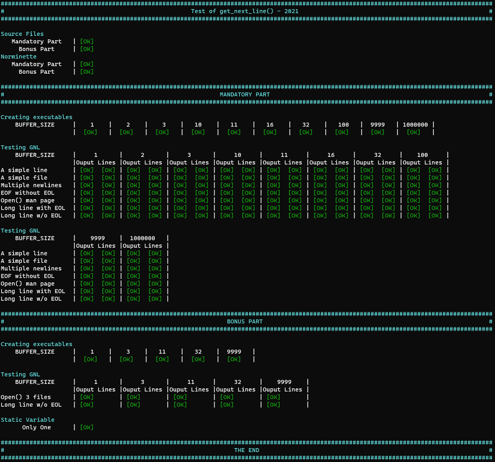

# GNL_tester
A tester for Get_Next_line (42cursus - 2021)



## How to use it

Clone this repository such that
```
|- getNextLine/
|- GNL_Tester/
```
and execute the following command
```bash
python run_test.py
```
> Note: Python 3.8.3 has been used to write the tester.

You can change the path of your get_next_line function by modifying the ```gnl_path``` in the header of ```run_test.py``` accordingly.

## What's supported
 
 - Norminette check
 - Mandatory part with multiple buffer size
 - Bonus part
	1. Check for a single ```static variable```
	2. Check if the function is able to manage multpile file descriptor.
 - Memory leaks

## License

Everything in this repository is released under the [Unlicense](https://github.com/maxdesalle/42/blob/main/LICENSE).
